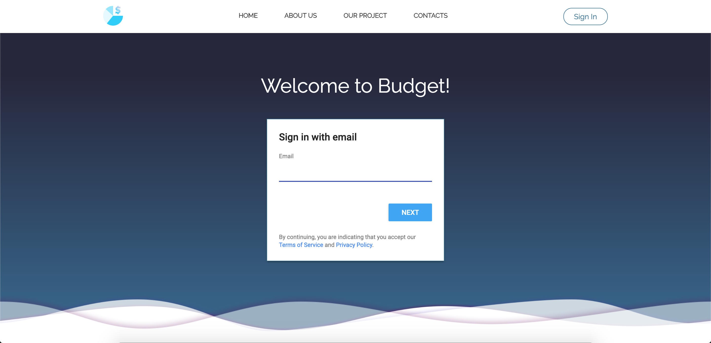
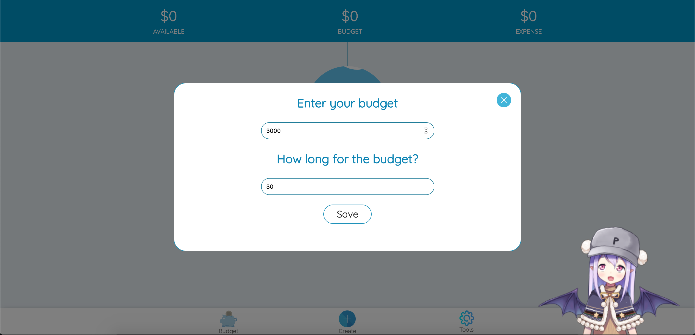
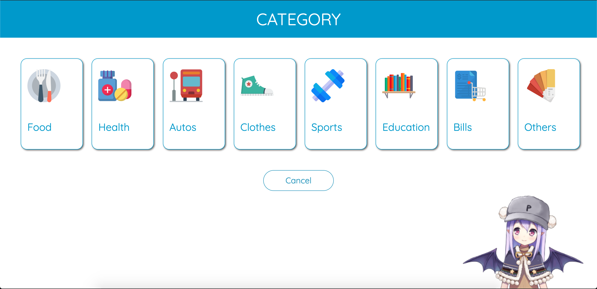
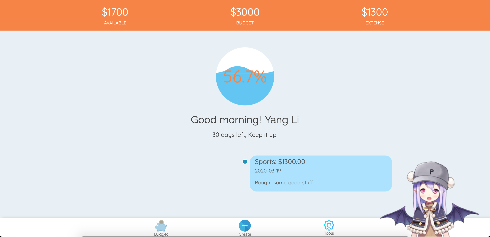
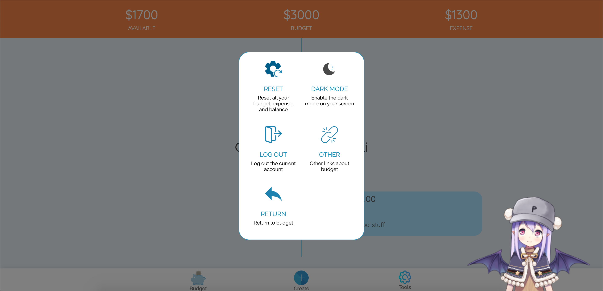
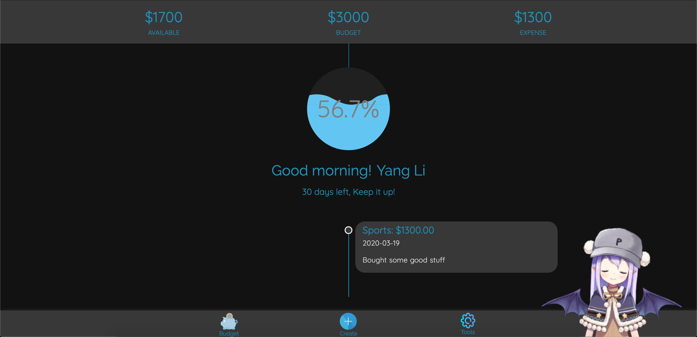

# COMP1930 Project Team 22

## Project Ideas

Our idea originated from a discussion of how we would survive the semester at BCIT. We talked about how we would balance our courses, social life, and finances. Then we had to do a project for our COMP 1930 class, so we decided to create something that could actually help us during out time with BCIT. So we decided to go with "Budget", our budget and expense tracking app.

## Screenshots
<i style="font-size: 13px">Login</i>

<i style="font-size: 13px">Enter budget and duration</i>

<i style="font-size: 13px">Expense category</i>

<i style="font-size: 13px">Animated water effect</i>

<i style="font-size: 13px">Settings</i>

<i style="font-size: 13px">Darkmode</i>

## Feature

- Add expenses to your account with simple click
- Water stimulate wave effect represents the left budget
- Multiple guid modal to help you use the app
- Live 2D animation widget chat box guide you to use the app
- Dark mode based on user preference
- Reset option to restart all your journey
- Dynamic nav bar and percentage number to notify users their current budget
- Add the duration for your budget tracking

## Team Member: 

[Yang Li](https://github.com/yang052513)   
[Jonny Lu](https://github.com/lynnoj)

## API//Source Code Reference:

- [foopicker](https://github.com/yogasaikrishna/foopicker)
- [live2d-widget](https://live2d.com)

## General Reference

- [Menhera-chan Emoji](https://www.pixiv.net/member.php?id=2302136)

## How to use the app?
We are hosting the web at [here](https://comp1930-inclass.firebaseapp.com)

## Common FAQ
### What is the largest number I can input?
The default budget limit is 10,000. As we consider the purpose of the app is for people who dont have a income source, and just want to track a limited budget for a period of time. So we think 10,000 is a good number to start. In future we might add user settings which you can actually change the max limit.

### How can I submit bugs/suggestion/.. ?
We have a spearate contact page which you can find on the nav bar of every page. In home page click tools > link > contact. 
The form will be sent to our backend page only, and we would like to hear your thoughts about Budget!

### I accidently disable the 2D animation girl, how could I make it display again?
After you dispaly the 2D animation girl, there will be a little blue box on the bottom left of the page. If you click it, the 2D animation girl will pop up again.

### Can I set a budget in a time frame?
The current version doesnt support time constraints. If you want to restart your track journey, you can click reset in the tool panel which will delete all the past expense history.

### What are some future features will be provided?
We are currently working on delete option which you could delete the expense that you clicked. We are also thinking to add a time frame to track the budget. If you have any other suggestions, please contacts us by sbumitting the form on contact page

## Change Log
### v0.0.6 (2019/12/05 16:32)
- Add a new feature: track length of your budget as you go
- Fix modal pop up mobile size 

### v0.0.5 (2019/12/03 21:05)
- Created feedback page for admin use only

### v0.0.4 (2019/12/03 09:33)
- Add the reset button so that user could reset their budget and history expenses
- Add logout options
- Add link modal in the tool kit panel
- Connect home logo to the landing page
- Fix set budget and enter category animation bugs
- Styling login page, add loop animated wave background aniimation

### v0.0.3 (2019/12/01 21:52)
- Fix 2D live extension hover text message (include all)
- Fix 2D live extension tips box gap
- Design dark mode color scheme
- Fix the balance number doesnt update after set new budget
- Fix the percentage number color corresponding to the nav bar
- Fix the new expense doesnt change color in dark mode
- Add welcome text message depending on the user computer currernt time
- Add Menhera-chan Emoji set for all modals

### v0.0.2 (2019/11/30 18:50)
- Limit user to input fraction unit while setting budget
- Fix expense number up to 2 decimal places
- Set a max number for budget input, with pop up modal to notify user
- Style home page nav bar
- Add read-more button on index, about us, contact us, our project page
- Change index, about us, our project page show case image to make sure consistency
- Add text indicator under the nav bar icon on home page
- Redesign index page layout CSS
#### **New Feature:**
  - Dark mode / Light mode
  - The color of nav bar will change with different level of balance
  - Balance added to the header, which shows how much left
  - Reset button: reset all the budget, expense, and balance to 0

### v0.0.1 (2019/11/28 20:15)
- First time release
- User set budget, create expense
- Index, About us, Contact, Our project.html

